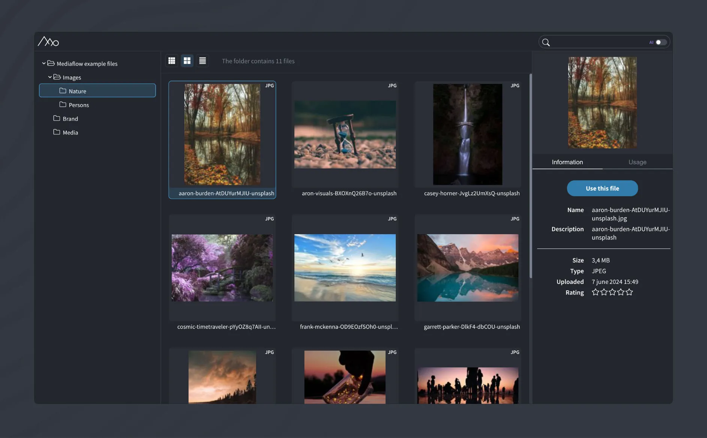

# Mediaflow

A Mediaflow integration plugin for CraftCMS

 

## Requirements

This plugin requires Craft CMS 5.7.0 or later, and PHP 8.2 or later.

## Installation

You can install this plugin from the Plugin Store or with Composer.

#### From the Plugin Store

Go to the Plugin Store in your project’s Control Panel and search for “Mediaflow”. Then press “Install”.

#### With Composer

Open your terminal and run the following commands:

```bash
# go to the project directory
cd /path/to/my-project

# tell Composer to load the plugin
composer require 99x/craft-mediaflow

# tell Craft to install the plugin
./craft plugin/install mediaflow
```

## Twig example

```twig
<div class="media-container">
    
        
        <div class="media-item main-media">
            
                <div class="video-wrapper">
                    {{ media.embedCode | raw }}
                </div>
            
                
            
            <div class="media-info">
                <p><strong>Name:</strong> {{ media.name }}</p>
                <p><strong>Filename:</strong> {{ media.filename }}</p>
                <p><strong>File Type:</strong> {{ media.filetype }}</p>
                
                    <p><strong>Dimensions:</strong> {{ media.width }} x {{ media.height }}</p>
                    <p><strong>Photographer:</strong> {{ media.photographer ?: 'Unknown' }}</p>
                
            </div>
        </div>
        <pre><code>{{ media.json | json_encode(constant("JSON_PRETTY_PRINT")) }}</code></pre>
    
</div>
```